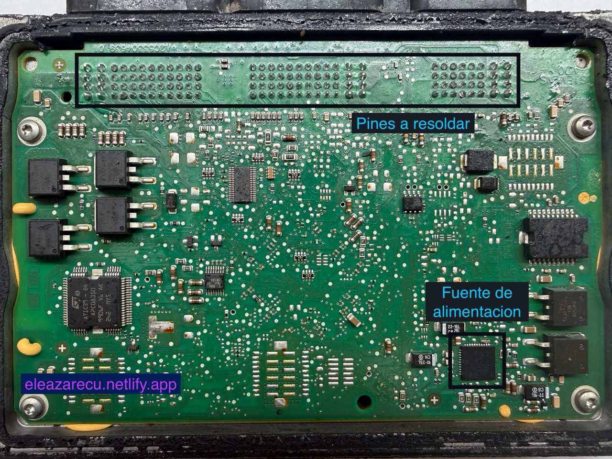
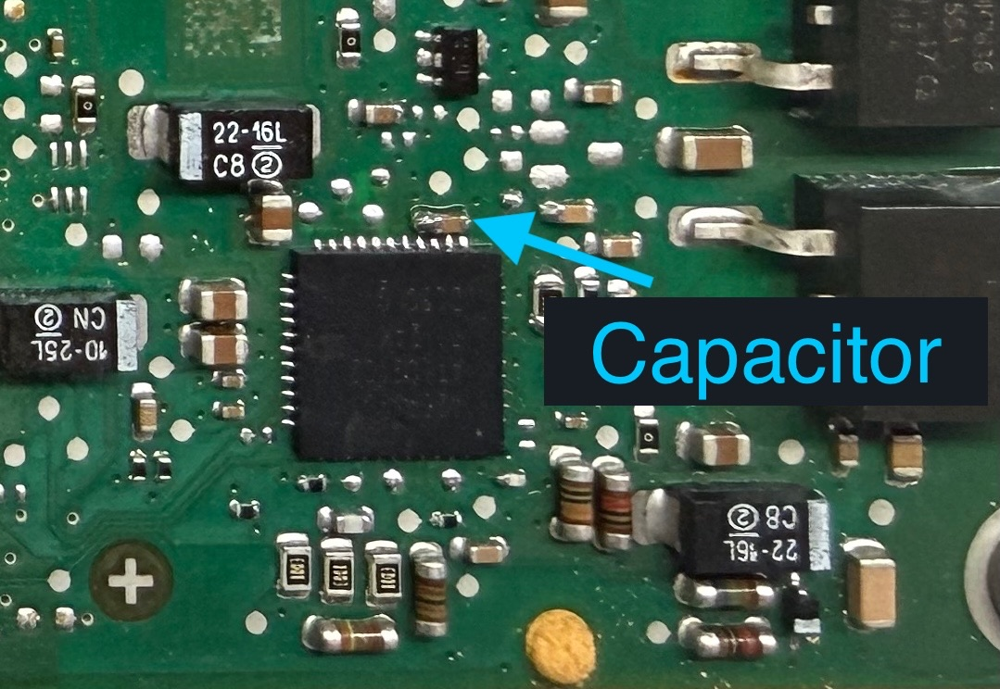

# 🚗 Solución a la falla de comunicación en la ECU EMS3110 de Renault Fluence

**Meta descripción:**  
Aprende cómo reparar la computadora **EMS3110** del **Renault Fluence** cuando deja de comunicar, se apaga o no enciende. Guía paso a paso para reactivar la ECU resoldando puntos clave.

---

## 🧩 Problema común en la ECU EMS3110

Un problema **muy común** en las computadoras **EMS3110**, que suelen encontrarse en los **Renault Fluence**, es que **dejan de comunicar**, **se apagan** o **no encienden**.  

Este fallo se debe, generalmente, a **soldaduras defectuosas o fracturadas** en los pines internos de la placa y en la **fuente de alimentación**.

---

## 🔧 Solución recomendada

La solución más efectiva que he encontrado consiste en:

1. **Resoldar los pines internos** que van clavados en la placa.  
2. **Quitar la soldadura vieja y resoldar la fuente de alimentación.**

Ten paciencia al abrir la ECU, ya que su carcasa está sellada con silicona y puede dañarse si se fuerza demasiado.

---

## 🪛 Cómo abrir la ECU correctamente

1. Aplica **calor alrededor de la tapa trasera** para ablandar la silicona.  
2. Usa un **desarmador plano** para hacer presión y levantar una esquina.  
3. Cuando logres despegar un poco la tapa, **inserta el desarmador** y ve levantando **lentamente** todo el borde.

:::tip
Usa **carbuclean** (disolvente) para que la silicona pierda adherencia y sea más fácil separar la tapa.
:::

---

## ⚡ Pines de comunicación y alimentación

Antes de resoldar toda la placa, puedes empezar **solo con los pines de comunicación**, **+12V** y **GND (tierra)**.

> **EMS3110 Pinout - Alientech**

Esto suele ser suficiente para **restablecer la comunicación** y verificar si la falla proviene de ahí.  
Una vez confirmada, procede a **resoldar todos los pines y la fuente de alimentación.**

---

## 🧰 Consejos al resoldar

Al trabajar con la fuente de alimentación:

- Retira la soldadura vieja con una **malla desoldadora**.  
- Luego aplica **estaño nuevo** en los mismos puntos.  

:::tip
Si el **capacitor** te estorba, puedes retirarlo temporalmente y volver a colocarlo cuando termines de resoldar.
:::

---

## 🚙 Resultado final

Después de realizar la resoldadura, el vehículo debería **volver a encender y comunicar correctamente**.  

Sin embargo, **no siempre será la solución definitiva**.  
Si la computadora **entró en corto**, será necesario **diagnosticar qué componente interno está afectado** antes de reemplazar la ECU.

---

## 📩 Conclusión

La ECU **EMS3110** del Renault Fluence presenta un fallo muy frecuente relacionado con soldaduras deterioradas y que los pines clavados empiezan a salirse por eso hay que soldarlos.  
Resoldar los puntos críticos suele resolver el problema de comunicación, apagado o encendido.  

Si tienes alguna duda o necesitas más orientación, **puedes enviarme un mensaje** y con gusto te ayudo.

---

**Palabras clave:**  
`Renault Fluence`, `EMS3110`, `ECU`, `falla comunicación`, `no enciende`, `reparar computadora automotriz`, `resoldar ECU Renault`, `fallas EMS3110`
