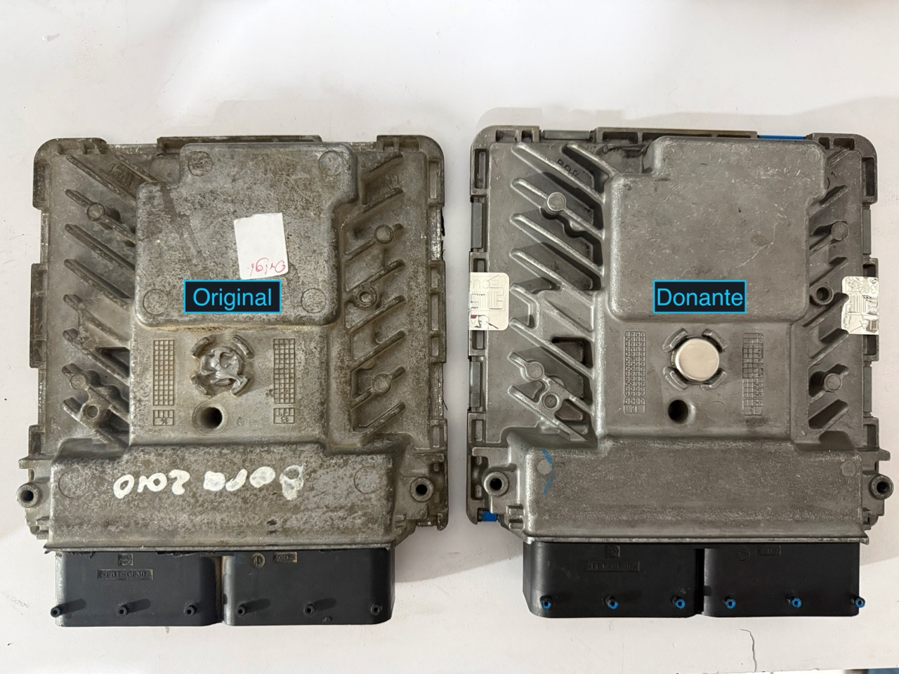
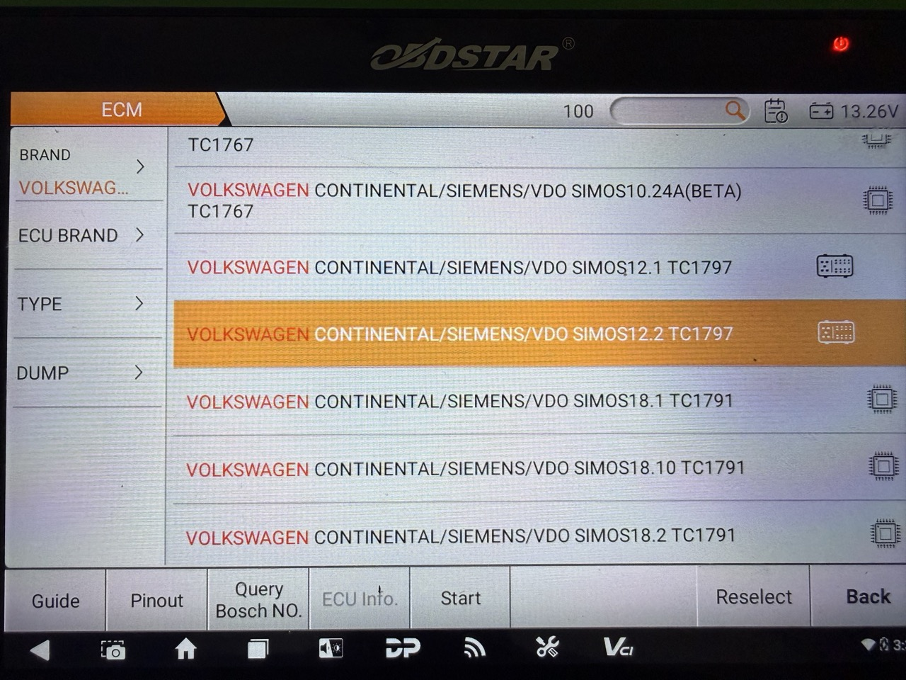
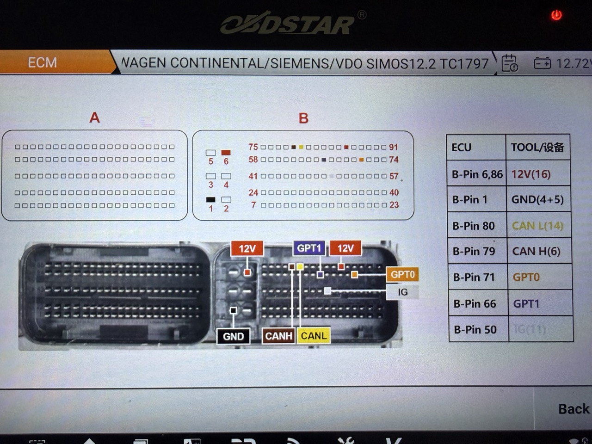
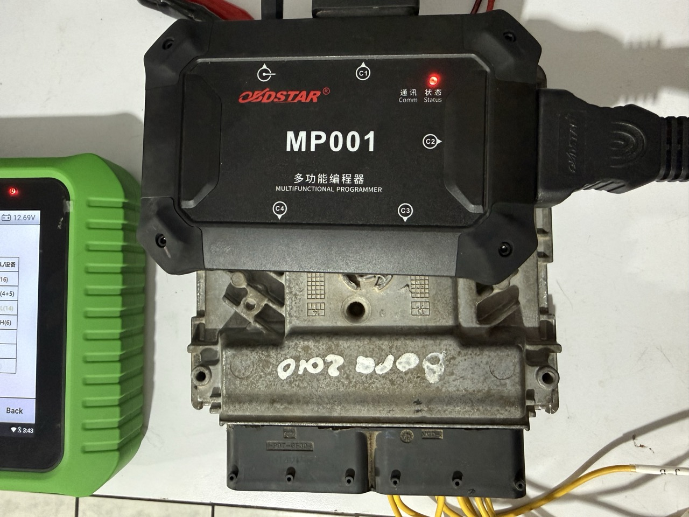
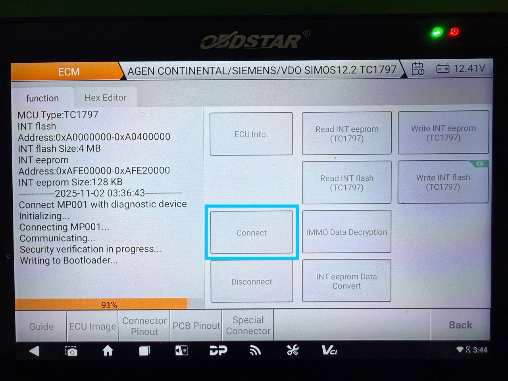
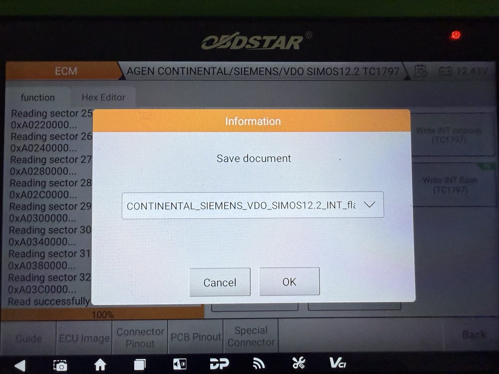
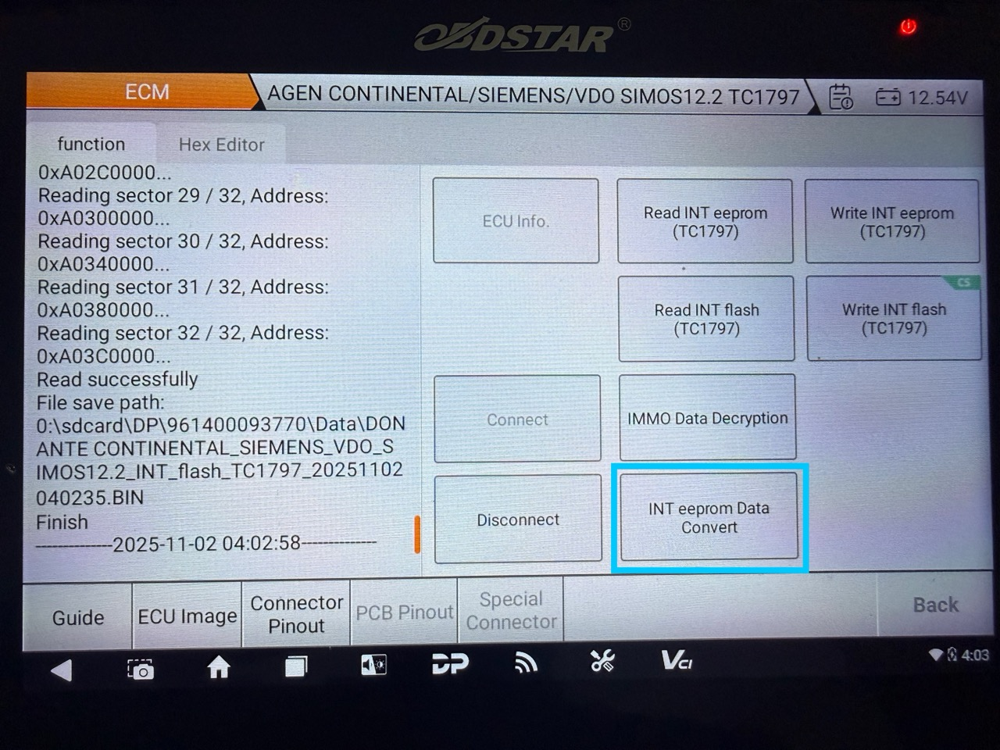
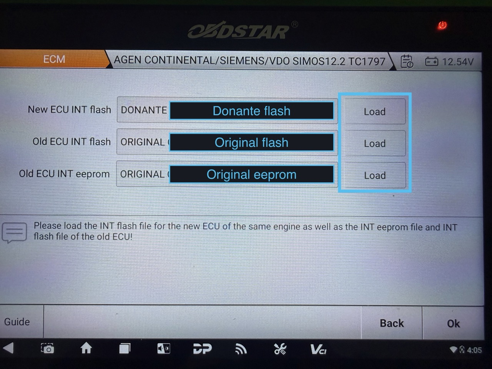
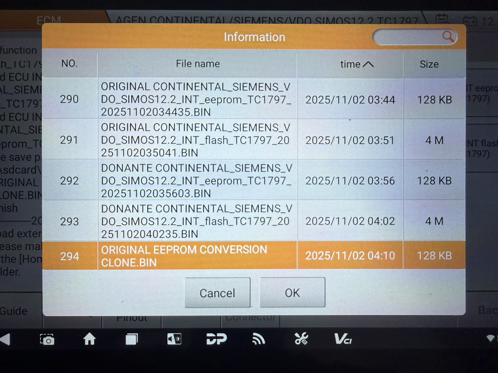

# 🚗 Cómo clonar una ECU Simos 12.2 de Volkswagen

Las computadoras **Simos 12.2** de Volkswagen son notoriamente difíciles de clonar debido a su **encriptación interna**. Aunque clones la EEPROM y la Flash, el vehículo no encenderá hasta desencriptar la EEPROM y obtener la **IMMO data real**.

En este artículo aprenderás cómo clonar una ECU Simos 12.2 paso a paso usando el **OBDSTAR KEY MASTER G3**. También puedes hacerlo con **FLEX** o **AUTOTUNER**.

---

## 🧠 Paso 1: Identificar las computadoras a clonar

Comienza con la computadora original para obtener su información **EEPROM** y **FLASH**.

---

## ⚙️ Paso 2: Leer la información de la ECU original

En el menú del OBDSTAR ve a:
**Ecu Flasher > ECM Autos > Brand: Volkswagen > SIMOS 12.2**

Presiona **Start**, asegúrate de estar conectado a internet y selecciona **Bench Mode**. Luego elige la herramienta **MP001**.

En la sección **Connector Pinout**, podrás ver cómo pinear la computadora:

### 📋 Pinout Simos12.2

| ECU            | TOOL      |
| -------------- | --------- |
| **B-Pin 6,86** | 12v(16)   |
| **B-Pin 1**    | GND(4+5)  |
| **B-Pin 80**   | CAN L(14) |
| **B-Pin 79**   | CAN H(6)  |
| **B-Pin 71**   | GPT0      |
| **B-Pin 66**   | GPT1      |
| **B-Pin 50**   | IG(11)    |

:::note[💡 Nota] 
Necesitas una fuente de 12V conectada al MP001. Puedes usar la del equipo o una externa.
:::

Presiona **Conectar** para establecer comunicación entre el OBDSTAR y la ECU.

:::note[💡 Nota] 
En el lado izquierdo verás los mensajes de progreso.
:::

Cuando se habiliten las opciones **Read/Write**, selecciona:

* **Read INT eeprom (TC1797)** → guarda como `original eeprom`
* **Read INT flash (TC1797)** → guarda como `original flash`

Desconecta de forma segura con **Disconnect**.

---

## 🔄 Paso 3: Conectar la ECU donante

Conecta la nueva ECU (donante) siguiendo el mismo [pinout](#-pinout-simos122).

Repite los pasos anteriores:

1. **Connect** → espera habilitar Read/Write
2. **Read INT eeprom (TC1797)** → guarda como `donante eeprom`
3. **Read INT flash (TC1797)** → guarda como `donante flash`

---

## 🧩 Paso 4: Convertir la EEPROM

En el menú selecciona **INT eeprom Data Convert**.

Carga los archivos en orden:

1. Donante flash
2. Original flash
3. Original eeprom

Luego da clic en **OK** para generar la EEPROM convertida.

:::note[⏱️ Nota]
Este proceso puede tardar desde segundos hasta varios minutos.
:::

Guarda el archivo como **`ORIGINAL EEPROM CONVERSION CLONE`**.

---

## 🖊️ Paso 5: Escribir la EEPROM clonada

Selecciona **Write INT eeprom (TC1797)** → **Load external data** → elige `ORIGINAL EEPROM CONVERSION CLONE`.

:::note[⚠️ Nota]
Si aparece un mensaje en letras rojas indicando que no soporta verificación, selecciona **Yes**.
:::

Después de escribir la EEPROM, presiona **Disconnect** y prueba la ECU en el vehículo. 🚘

---

## ❓¿Es necesario escribir la Flash?

Solo si el **número de parte de la ECU donante** es diferente al de la original.

Si deseas hacerlo:

1. Selecciona **Write INT flash (TC1797)**
2. Carga `original flash`
3. Presiona **No** en la verificación
4. Espera unos minutos hasta finalizar

:::note[🔁 Nota]
Si ocurre un error de comunicación, desconecta la fuente 10 segundos, vuelve a conectar y repite el proceso.
:::
---

## ✅ Conclusión

Con este procedimiento podrás **clonar una ECU Simos 12.2 de Volkswagen** de manera segura y profesional. El uso del OBDSTAR G3 simplifica el proceso de lectura, escritura y conversión de datos sin comprometer la integridad del vehículo.

---

## 📌 Checklist rápido

* [x] Leer EEPROM y Flash originales
* [x] Leer EEPROM y Flash donante
* [x] Convertir EEPROM con datos IMMO
* [x] Escribir EEPROM convertida en la nueva ECU
* [x] Probar en el vehículo

---

## 🙋‍♂️ Preguntas frecuentes (FAQ)

**¿Qué pasa si el vehículo no arranca?**
Verifica que el archivo EEPROM haya sido correctamente convertido y escrito.

**¿Puedo hacerlo sin conexión a internet?**
No, OBDSTAR requiere conexión activa durante la operación.

**¿FLEX o AUTOTUNER son más rápidos?**
Depende del modelo y versión, pero OBDSTAR G3 es más accesible y seguro para Simos 12.2.

---

✨ **¿Te resultó útil este tutorial?** Compártelo con otros técnicos y sígueme para más guías de clonación ECU y diagnóstico automotriz.

---
**Palabras clave:**  
**Principal:** `clonación ECU Volkswagen`, `ECU Simos 12.2`, `OBDSTAR KEY MASTER G3`, `eeprom y flash`, `bench mode`, `immo data`, `ECU donante`.  
**Secundarias:** `cómo clonar ECU`, `diagnóstico automotriz`, `herramientas de programación`, `software OBD`, `clonación ECU paso a paso`, `immo off`, `reprogramación ECU`, `reparación electrónica automotriz`.