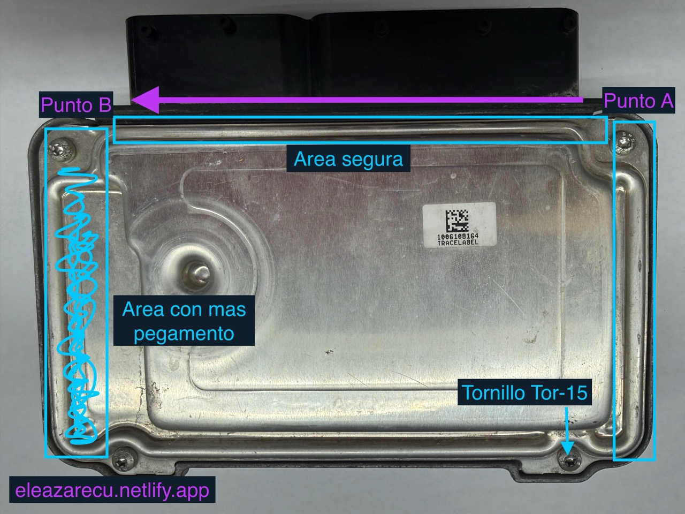
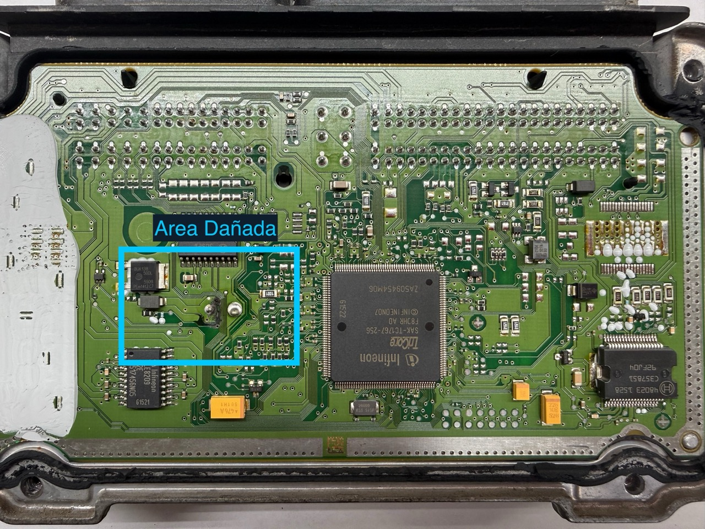
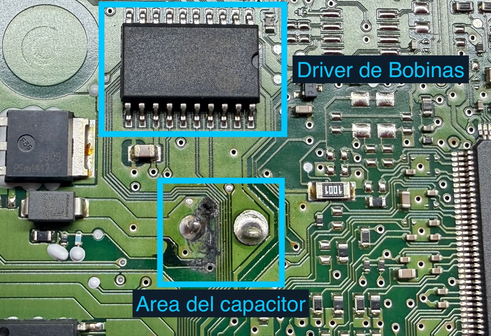
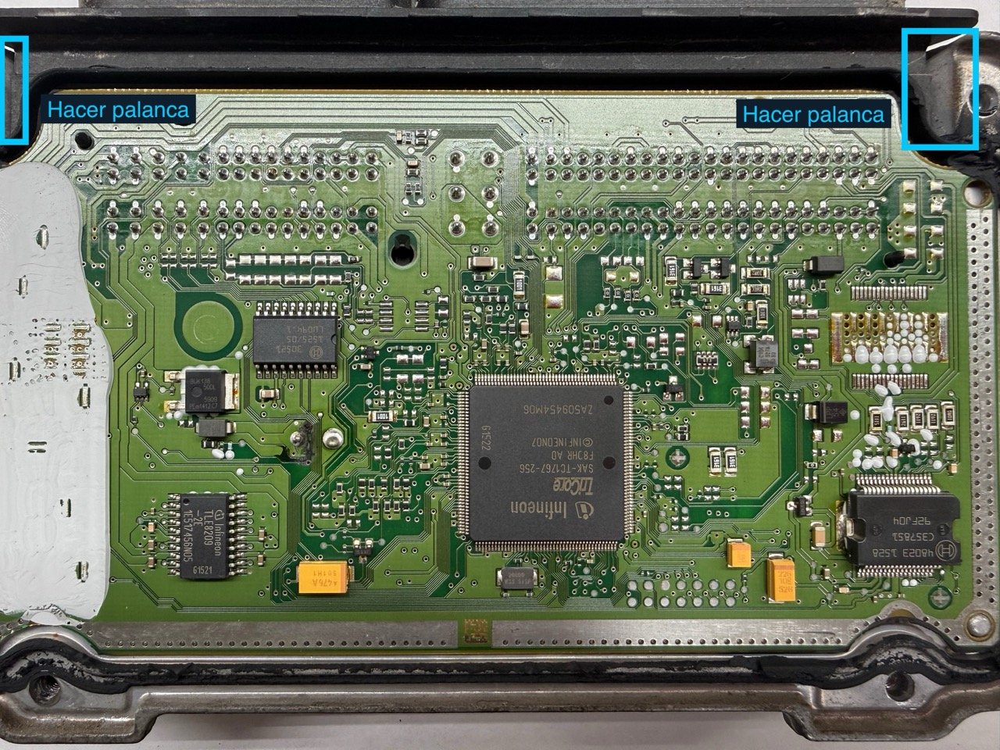

# Falla común en computadoras ME17.5 y ME17.5.6 de Volkswagen

¿Tu Volkswagen **tarda en encender** o se **apaga repentinamente**?  
Este problema es mucho más común de lo que parece y está relacionado con una falla en la **computadora del motor (ECU)**, especialmente en los modelos que usan la unidad **ME17.5 o ME17.5.6**.

En esta guía aprenderás paso a paso cómo **diagnosticar y reparar** esta avería de forma profesional y segura.

---

## 🚗 Modelos afectados

La falla es frecuente en los siguientes modelos de **Volkswagen**:

- **Jetta** 2.0 / 2.5 *(2009–2017)*  
- **Golf** 2.0 / 2.5 *(2009–2017)*  
- **Passat** 2.0 / 2.5 *(2011–2016)*  
- **Beetle** 2.0 / 2.5 *(2009–2017)*  

:::note[Nota]
Estos motores son de tipo **aspirado naturalmente (no turbo)**.
:::

---

## ⚙️ Causa del problema

Todos estos modelos comparten la ECU **ME17.5 / ME17.5.6**, la cual suele fallar debido a un **capacitor electrolítico deteriorado**.

Con el tiempo, este capacitor pierde su capacidad y comienza a **derramar un líquido corrosivo** que daña las pistas internas de la placa.  
El resultado: la computadora no logra retener la energía suficiente, generando **apagones intermitentes, dificultad de arranque o pérdida de señal en bobinas**.

---

## 🧰 Solución paso a paso

### 1. Retirar la computadora del vehículo

Este paso puede ser el más complicado, ya que las ECU suelen venir protegidas.  
Usa herramientas adecuadas para retirarla sin dañar conectores ni soportes.  
Si es necesario, corta la base plástica de sujeción.

Una vez libre, podemos proceder a abrirla.

---

### 2. Apertura segura de la ECU

:::note[Nota]
En la imagen se muestran las zonas seguras para hacer palanca con un desarmador.
:::

1. Retira los tornillos **Torx T15**.  
2. Con un desarmador plano, levanta ligeramente la esquina del **punto A**, usando el plástico como apoyo.

:::important[Importante]
Evita usar fuerza excesiva; podrías romper el conector.  
Solo necesitas sentir cómo se despega ligeramente.
:::

3. Levanta poco a poco entre los **puntos A y B**.  
   Puedes aplicar **Carbuclean** para ablandar el pegamento.

---

### 3. Identificar el daño

Abre la tapa y observa el área del **capacitor**:

Si ves manchas oscuras o residuos, probablemente el líquido del capacitor haya dañado la pista que alimenta el **driver de bobinas**, lo que genera:
- Bobina activa permanente  
- Pulsos erráticos con la llave en ON  
- Pérdida total de chispa en un cilindro

Limpia el área afectada con **Carbuclean** o **alcohol isopropílico** y un cepillo.

---

### 4. Remover el capacitor dañado

Para acceder al capacitor, separa la tarjeta de la carcasa de aluminio con cuidado.

El capacitor dañado es **cilíndrico, de color azul**, y suele ser el único con esa forma.

> Fuente: [Prashan Weerasinghe – LinkedIn](https://www.linkedin.com/posts/prashan-weerasinghe-69186b195_vw-jetta-me1756-ecu-cloning-and-programming-activity-7249259049546883072-L3yn)

---

## 🔋 Especificaciones del capacitor

| Propiedad        | Valor recomendado |
|------------------|-------------------|
| **Capacitancia** | 220 µF            |
| **Voltaje**      | 50 V (o mayor)    |
| **Tipo**         | Electrolítico     |

Puedes conseguirlo fácilmente en tiendas como **Steren** o **Mouser**.

:::important[Importante]
El voltaje puede ser **mayor a 50 V**, pero **nunca menor**, ya que podría dañar la ECU.
:::

Los capacitores electrolíticos tienen polaridad:  
El lado **negativo** se identifica por una **franja blanca o negra** en el costado.

---

## 🔧 Reemplazo del capacitor

1. Retira el capacitor viejo tirando suavemente mientras calientas las patas con el cautín.  
2. Limpia el estaño con **malla desoldadora** o **extractor de soldadura**.  
3. Coloca el nuevo capacitor respetando la polaridad y solda.  
4. Corta el exceso de terminales.

:::note[Nota]
En estas placas, el agujero **más grande** corresponde al polo **negativo**.
:::

---

## ✅ Resultado y recomendaciones finales

Después del reemplazo, la computadora debería funcionar correctamente.  
En la mayoría de los casos, **este capacitor es la causa del problema**, incluso si no hay líquido visible.

Si el fallo persiste, considera:
- **Resoldar el microprocesador** (solo con experiencia).  
- Revisar la **fuente de alimentación interna**, que puede cortar por temperatura.

---

## 💬 Conclusión

Reparar esta falla en la **ECU ME17.5** no solo ahorra dinero, sino que también prolonga la vida útil del vehículo.  
Con las herramientas adecuadas y un poco de paciencia, puedes **recuperar la funcionalidad de la computadora del motor sin reemplazarla completa**.

¿Tienes dudas o quieres compartir tu experiencia?  
Contáctame directamente. 🚗💡
